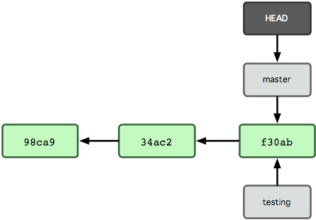

# Git 简介

1. 分布式版本控制系统
2. 直接记录快照，而非差异比较
3. 近乎所有操作都是本地执行

### Git 文件的三种状态

对于任何一个文件，在 Git 内都只有三种状态

1. 已提交（committed）
2. 已修改（modified）
3. 已暂存（staged）


所以基本的工作流程是

1. 在工作目录中修改某些文件。
2. 对修改后的文件进行快照，然后保存到暂存区域。
3. 提交更新，将保存在暂存区域的文件快照永久转储到 Git 目录中。

### Git 配置
git config 命令

1.  git config --system 系统中对所有用户都普遍适用的配置
2.  git config --global 用户目录下的配置文件只适用于该用户
3.  git config  当前项目的 Git 目录中的配置文件

```
$ git config --global user.name "ZhengJie"
$ git config --global user.email zhengjie@ushow.media
```

# Git 基础

### 别名

推荐mac/linux使用zsh并安装[oh my zsh](http://ohmyz.sh/), 会极大方便git命令的操作
包括git命令别名和自动补全的配置

### 基本操作

```
$ git status (gst)

$ git init

$ git clone git://xxxxxx.git

$ git add *.c
$ git add README 

$ git commit -m 'initial project version'

$ git pull  

$ git fetch origin/master
$ git merge

```

### 查看变化

diff工具, mac用户推荐[Kaleidoscope](http://www.kaleidoscopeapp.com/)

```
$ gitk
$ stree

$ git diff
$ git diff --cached
$ git difftool --cached

```

### 撤销操作

```
$ git checkout hello.rb 撤销本地更改

```

```
$ git reset HEAD hello.rb 撤销暂存的更改

```

```
$ git revert HEAD 撤销提交的更改

```

```
$ git reset --hard commitId  从分支移除提交(危险操作)

```

#### 修正提交

```
$ git commit --amend -a 修改最后一次提交
```

### 打标签

```
$ git tag -a tag_name -m 'tag comment'
$ git push origin tag_name
```

# Git 分支

Git 中的分支，其实本质上仅仅是个指向 commit 对象的可变指针
Git 是如何知道你当前在哪个分支上工作的呢？其实答案也很简单，它保存着一个名为 HEAD 的特别指针

```
$ git branch testing
```


## 分支管理

```
$ git branch new_branch  		创建分支
$ git checkout new_branch     切换分支
$ git branch -d new_branch 	删除分支
$ git push origin new_branch  推送分支

```

## 分支合并

合并分支有2种方式merge和rebase

通常merge操作

```
$ git checkout master
$ git merge experiment

```


使用rebase操作

```
$ git checkout experiment
$ git rebase master
```


```
$ git pull --rebase  拉取并衍合(gup)
$ git cherry-pick commitId  单独从别的分支提交(gcp)
```

何时衍合，何时合并? 对短期生命的本地分支使用衍合，而对公开仓库的分支使用合并

# Arcanist工具使用

工作流程

提交代码

```
$ git commit -a 
$ arc diff HEAD^ --create
$ arc diff 45dd426..HEAD --create

```
通过审核

```
$ arc land; 使用这种方式提交，貌似合并的代码就不用再review了 
$ git push;

```
未通过审核

```
$ git commit -a --amend
$ arc diff --update Dxxx
```
审核操作

```
arc patch --nobranch DXXX(Diff ID)

```
·	arc todo <description> [option]可以快速给自己在phabricator上创建task，[option]用于把task CC给其他人.
·	arc tasks [options] 查看Maniphest的tasks。


